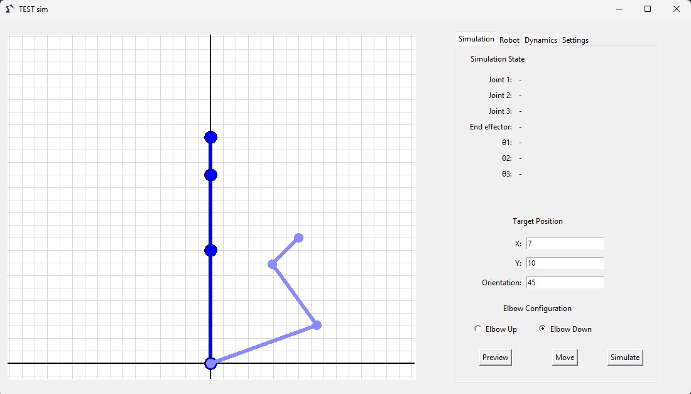
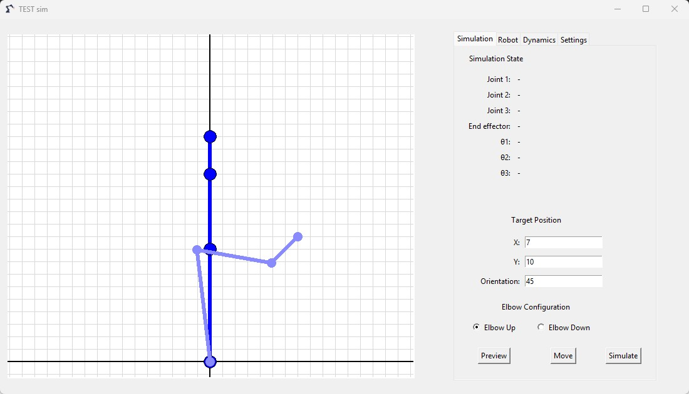
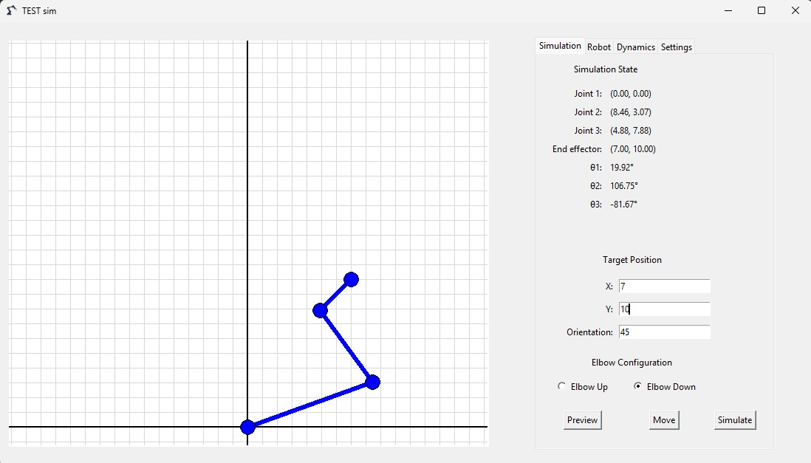

# 3-DOF Planar Arm Kinematics and Dynamics Simulator

> A Python-based GUI simulator built with Tkinter for a 3-DOF planar robotic arm. The application implements forward and inverse kinematics, supports elbow-up and elbow-down IK configurations, and allows users to preview or apply a target end-effector pose `(x, y, φ)`. The project is being developed toward trajectory, dynamics, and joint-torque simulation.

## Features
- 3-DOF planar robotic arm visualization
- Configurable link lengths
- End-effector target position input `(x, y)`
- End-effector orientation input `φ`
- Forward kinematics calculation
- Inverse kinematics calculation
- Elbow-up and elbow-down inverse-kinematics solutions
- Target configuration preview using a ghost robot visualization
- Direct application of the selected IK configuration through the `Move` control
- Simulation State panel displaying:
  - Joint positions
  - End-effector position
  - Joint angles `θ1`, `θ2`, and `θ3`
- Cartesian grid visualization
- Light and dark appearance modes
- Tabbed Tkinter interface for:
  - Simulation
  - Robot configuration
  - Dynamics
  - Settings

## Simulation Examples

The simulator can calculate both inverse-kinematics branches for a reachable
target pose. The selected configuration can first be previewed as a lighter
ghost representation before being applied to the robot model.

The following examples use:
- `L1 = 9`
- `L2 = 6`
- `L3 = 3`
- Target pose: `(x = 7, y = 10, φ = 45°)`

<figure>
    
    <figcaption>Elbow-up inverse-kinematics configuration for the target pose (x = 7, y = 10, φ = 45°) with link lengths [9, 6, 3]. The target configuration is displayed as a lighter ghost arm while preserving the robot's current configuration.</figcaption>
</figure>

<figure>
    
    <figcaption>Elbow-down inverse-kinematics configuration for the target pose (x = 7, y = 10, φ = 45°) with link lengths [9, 6, 3]. The target configuration is displayed as a lighter ghost arm while preserving the robot's current configuration.</figcaption>
</figure>

<figure>
    
    <figcaption>Elbow-down inverse-kinematics configuration for the target pose (x = 7, y = 10, φ = 45°) with link lengths [9, 6, 3]. The selected configuration is applied to the robot, and the simulation state panel displays the resulting joint positions and joint angles.</figcaption>
</figure>

## Interface

The application is organized into four tabs:

- **Simulation:** target pose, elbow configuration, preview, movement controls, and current robot state.
- **Robot:** manipulator geometry and link-length configuration.
- **Dynamics:** interface for mass and payload parameters; calculations are currently under development.
- **Settings:** application appearance and visualization settings.

## Kinematic Model

The simulator implements forward and inverse kinematics for a 3-DOF planar manipulator.

The end-effector pose is defined by:

$$x = L_1\cos\theta_1+L_2\cos(\theta_1+\theta_2)+L_3\cos(\theta_1+\theta_2+\theta_3)$$

$$y = L_1\sin\theta_1+L_2\sin(\theta_1+\theta_2)+L_3\sin(\theta_1+\theta_2+\theta_3)$$

$$\phi = \theta_1+\theta_2+\theta_3$$

Inverse kinematics is used to obtain the joint angles from a desired end-effector pose `(x, y, φ)`.

For the full mathematical derivation, see:

[Full Kinematic Model](docs/Kinematic_Model.pdf)

## Tech Stack

## Current Limitations

- Joint limits are not yet implemented.
- Collision detection is not implemented.
- `Move` currently applies the selected target configuration without trajectory interpolation or motion animation.
- The `Simulate` control is currently a UI placeholder and does not yet perform a dynamic simulation.
- Velocity and acceleration profiles are not yet implemented.
- Robot dynamics and joint torque calculations are not yet implemented.
- The current implementation focuses primarily on position-level kinematics.

> **Note:** Dynamic simulation is under development. The current `Simulate` button is reserved for the future dynamics and trajectory execution workflow.

## Development Roadmap

| Category | Progress | Features | Status |
| :--- | :---: | :--- | :---: |
| **Core Simulation** | `■■■■■■■□□□` 70% | Forward/inverse kinematics, configurable link lengths, elbow-up/down IK solutions, target preview, and direct pose application. **Pending:** joint limits, trajectory generation, and motion animation. | 🔄 In progress |
| **Visualization** | `■■■■■■■■□□` 80% | Tabbed Tkinter GUI, Cartesian grid, light/dark mode, ghost configuration preview, and live joint/end-effector state display. **Pending:** graphical end-effector orientation and additional visualization controls. | 🔄 In progress |
| **Trajectory Planning** | `■□□□□□□□□□` 10% | UI structure prepared for movement execution. **Pending:** MoveJ, MoveL, MoveC, interpolation, velocity profiles, and trajectory validation. | 🔄 Early development |
| **Advanced Kinematics** | `□□□□□□□□□□` 0% | Jacobian calculation and velocity analysis. | ⏳ Planned |
| **Dynamics** | `□□□□□□□□□□` 0% | Dynamic simulation, robot dynamics, and joint torque calculation. | ⏳ Planned |
