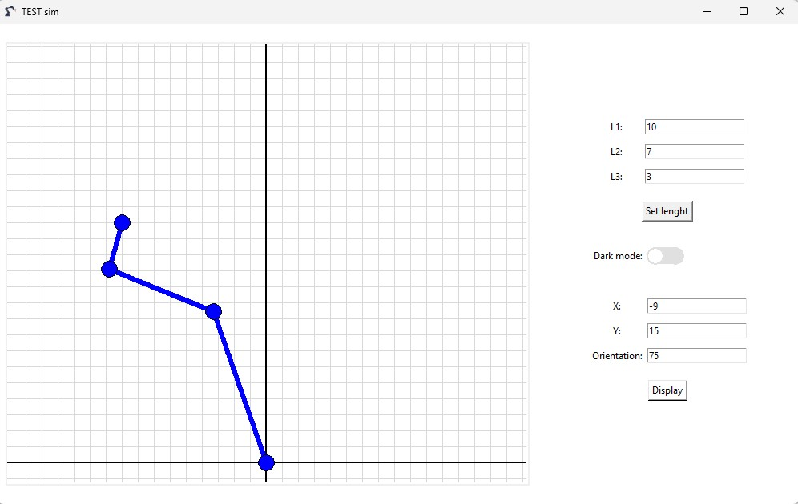
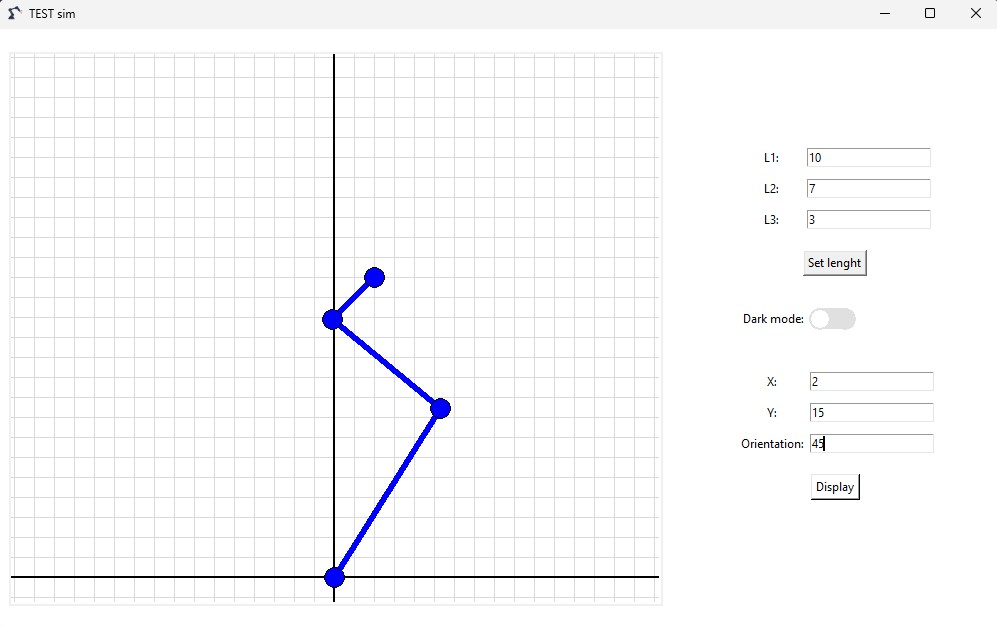
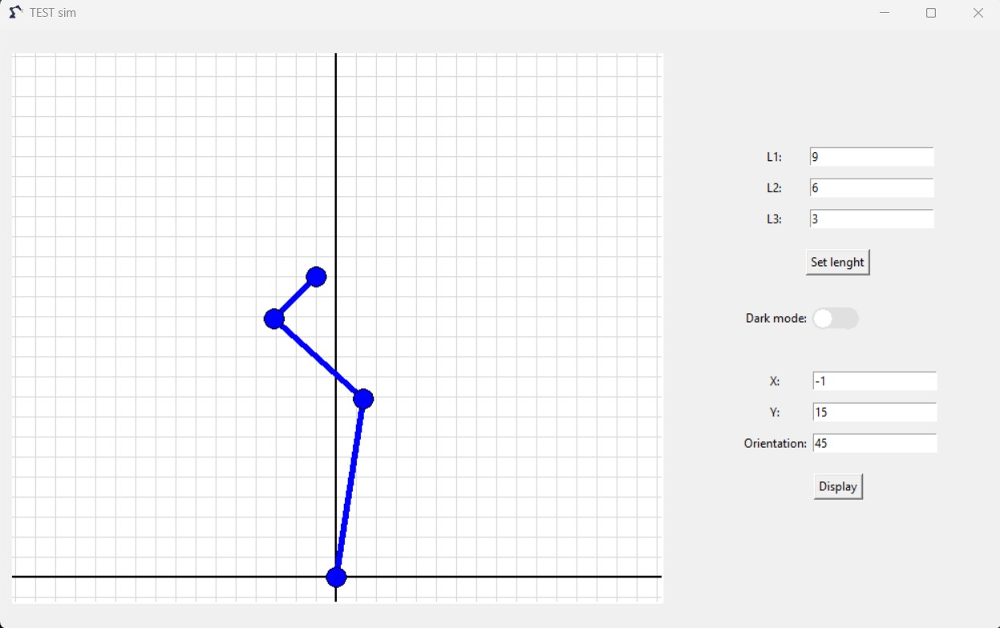

# 3-DOF Planar Arm Kinematics and Dynamics Simulator

> A Python-based GUI simulator built with Tkinter for a 3-DOF planar robotic arm. The application implements forward and inverse kinematics, allowing users to configure link lengths and define a target end-effector pose `(x, y, φ)`, then visualizes the resulting robot configuration.

## Features
- 3-DOF planar robotic arm visualization
- Configurable link lengths
- End-effector target position input `(x, y)`
- End-effector orientation input `φ`
- Forward kinematics calculation
- Inverse kinematics calculation
- Cartesian grid visualization

## Simulation Examples
<figure>
    
    <figcaption>Inverse-kinematics solution for target pose (x = -9, y = 15, φ = 75°) with link lengths [10, 7, 3].</figcaption>
</figure>

<figure>
    
    <figcaption>Inverse-kinematics solution for target pose (x = 2, y = 15, φ = 45°) with link lengths [10, 7, 3].</figcaption>
</figure>

<figure>
    
    <figcaption>Inverse-kinematics solution for target pose (x = -1, y = 15, φ = 45°) with link lengths [9, 6, 3].</figcaption>
</figure>

## Kinematic Model

The simulator implements forward and inverse kinematics for a 3-DOF planar manipulator.

The end-effector pose is defined by:

$$x = L_1\cos\theta_1+L_2\cos(\theta_1+\theta_2)+L_3\cos(\theta_1+\theta_2+\theta_3)$$

$$y = L_1\sin\theta_1+L_2\sin(\theta_1+\theta_2)+L_3\sin(\theta_1+\theta_2+\theta_3)$$

$$\phi = \theta_1+\theta_2+\theta_3$$

Inverse kinematics is used to obtain the joint angles from a desired end-effector pose `(x, y, φ)`.

For the full mathematical derivation, see:

[Full Kinematic Model](docs/Kinematic_Model.pdf)

## Tech Stack

## Current Limitations

- Only one inverse-kinematics branch is currently implemented, so only one valid elbow configuration is displayed for a reachable target pose.
- Joint limits are not yet implemented.
- Collision detection is not implemented.
- Dynamic motion between poses is not yet animated.
- The current simulator focuses primarily on kinematics.
- Dynamics and torque calculations are planned for future versions.

## Development Roadmap

| Category | Progress | Features | Status |
| :--- | :---: | :--- | :---: |
| **Core Simulation** | `■■■■■■□□□□` 57% | Forward and inverse kinematics, configurable link lengths, and robot visualization. *Pending: elbow-up/down solutions, joint limits, and motion animation.* | 🔄 In progress |
| **Visualization** | `■■■■■■■□□□` 67% | Basic Tkinter GUI, Cartesian grid, end-effector orientation input, and light/dark mode prototype. *Pending: joint angle display and graphical end-effector orientation.* | 🔄 In progress |
| **Advanced Kinematics** | `□□□□□□□□□□` 0% | Jacobian calculation and velocity analysis. | ⏳ Planned |
| **Dynamics** | `□□□□□□□□□□` 0% | Robot dynamics and joint torque calculation. | ⏳ Planned |
